# PRACTICA 03
<h2>¿Por qué el lenguaje de máquina es importante para definir la arquitectura computacional?</h2>

El lenguaje de máquina es relevante porque brinda un canal de comunicación directo, permitiendo la interacción entre el programador y la capa física, es decir el hardware subyacente. 
Es un pilar importante para la arquitectura computacional al ser un sistema de códigos que pueden ser interpretados por circuitos micro programables que se encargan de determinar cuáles son las acciones que deben de ser realizadas por una máquina. Para comprender este lenguaje de bajo nivel es necesario comprender a grandes rasgos el funcionamiento del hardware, con esto se es posible desarrollar sistemas operativos y compiladores que permitan interpretar al lenguaje máquina los lenguajes de alto nivel.

# PRACTICA 02
<h2>¿Cuál es el objetivo de cada uno de esos proyectos con sus palabras y describa que debe hacer para desarrollarlo?</h2>

En la lógica aritmética se evidencian las funciones básicas del computador al ejecutar operaciones de suma y resta de las entradas 
desde un punto de vista bit a bit, toda la lógica para realizar operaciones matematicas y lógicas se encuentra en la ALU.
Mientras que en la lógica secuencial nos muestra como el computador almacena sus valores en memoria, y como es posible cambiar y consultar estos valores.

<h2>Explique las principales diferencias entre la lógica aritmética y la lógica secuencial</h2>

La principal diferencia se basa en la realimentación que existe en sus compuertas para guardar valores en memoria para posteriores operaciones,
mientras que en la lógica aritmética las entrada de una compuerta depende de la salidas de otra.

## PROYECTO-03: Lógica Secuencial
### DFF

Esta función almacena y controlar el flujo de datos binarios. Es un elemento fundamental en la construcción de registros, contadores y otros componentes de circuitos secuenciales.

Funcionamiento:

<ul>
  <li>Entrada de Datos (D): El D Flip-Flop tiene una entrada llamada "D" (Data) que se utiliza para ingresar el dato que se desea almacenar. Esta entrada puede ser 0 o 1, representando los valores lógicos binarios.

  <li>Reloj (Clock): También tiene una entrada llamada "Clock" que controla cuándo se debe leer el valor presente en la entrada D y cargarlo en el Flip-Flop. El Flip-Flop almacena el valor de D solo en los flancos del 
   reloj (flanco ascendente o descendente, dependiendo del tipo de DFF).

  <li>Salida (Q): El D Flip-Flop tiene una salida llamada "Q" que representa el valor almacenado en ese momento. La salida Q refleja el valor de la entrada D solo cuando ocurre un flanco de reloj.

  <li>Salida Inversa (Q'): Algunos D Flip-Flops también tienen una salida inversa, denotada como "Q'", que es la negación de la salida Q. Esto significa que Q' siempre es el complemento lógico de Q.

  <li>Set y Reset (S y R): Algunos D Flip-Flops también incluyen entradas de "Set" y "Reset" para permitir el borrado o establecimiento del valor almacenado. Cuando la entrada Set (S) se activa, la salida Q se establece 
  en 1. Cuando la entrada Reset (R) se activa, la salida Q se borra a 0.
</ul>

### BIT

es la unidad más pequeña de información en sistemas digitales y computación. Un bit puede tener uno de dos valores posibles: 0 o 1.

Los bits se utilizan en operaciones lógicas como AND, OR, NOT y XOR. Estas operaciones permiten realizar cálculos y tomar decisiones basadas en condiciones lógicas. Por ejemplo:

<ul>
  
  <li>La operación AND entre dos bits solo es igual a 1 si ambos bits son 1; de lo contrario, el resultado es 0.

  <li>La operación OR entre dos bits es igual a 1 si al menos uno de los bits es 1; si ambos son 0, el resultado es 0.
</ul>

### Register

se utiliza para almacenar y manipular datos de 16 bits. Un registro es un conjunto de elementos de almacenamiento de datos que pueden almacenar información temporalmente y permitir su procesamiento. En el caso de un registro de 16 bits, puede almacenar valores binarios de 16 dígitos (0s y 1s). 

Funcionamiento:

<ul>
  
 <li>Estructura: Un registro de 16 bits está compuesto por 16 elementos de almacenamiento, conocidos como flip-flops o biestables, que pueden almacenar un valor binario (0 o 1) cada uno. Cada flip-flop representa un bit 
     individual en el registro.

 <li>Entrada de Datos: Los registros de 16 bits pueden tener una entrada de datos (o múltiples entradas) que permite cargar un valor de 16 bits en el registro. Los datos se ingresan en formato binario.

 <li>Lectura y Escritura: Puedes leer el valor almacenado en el registro de 16 bits desde su salida. También es posible escribir nuevos valores en el registro al proporcionar datos en las entradas correspondientes.

 <li>Operaciones Aritméticas y Lógicas: Los registros de 16 bits son componentes comunes en la aritmética digital y las operaciones lógicas. Se utilizan para realizar sumas, restas, multiplicaciones, divisiones y otras 
 operaciones matemáticas en números de 16 bits. También se pueden utilizar para operaciones lógicas como AND, OR, NOT, XOR, etc.

 <li>Desplazamiento de Bits: Los registros de 16 bits se pueden utilizar para realizar operaciones de desplazamiento de bits, que son útiles en aplicaciones como la manipulación de datos y la criptografía.

 <li>Almacenamiento Temporal: Estos registros son utilizados en aplicaciones donde se necesita almacenar datos temporalmente antes de su procesamiento o transferencia a otros componentes del sistema.

 <li>Conexión en Serie: A menudo, varios registros de 16 bits se pueden conectar en serie para formar registros más anchos, como registros de 32 bits o 64 bits. Esto se utiliza para manejar números más grandes y 
 realizar cálculos más complejos.

 <li>Control: Los registros de 16 bits pueden estar acompañados de circuitos de control que determinan cuándo se deben leer o escribir datos en el registro y cuándo se deben realizar operaciones específicas.
 </ul>

 ### RAM8

es un tipo de memoria volátil utilizada en sistemas digitales para almacenar datos temporalmente. En este caso, la RAM tiene 8 registros de almacenamiento, y cada registro tiene una capacidad de 16 bits, lo que significa que cada uno puede almacenar una palabra de 16 bits de información.

Funcionamiento:

<ul>
  
 <li>Estructura: Esta RAM tiene 8 registros de almacenamiento, numerados típicamente del 0 al 7, que se utilizan para almacenar datos de 16 bits cada uno. Cada registro se puede ver como una caja en la que se almacena 
 una palabra binaria de 16 bits.

 <li>Acceso Aleatorio: La característica clave de la memoria RAM es que permite el acceso aleatorio a cualquier registro. Esto significa que se puede leer o escribir en cualquiera de los 8 registros sin importar su 
 orden.Cada registro se identifica mediante una dirección única.

 <li>Lectura y Escritura: Puedes leer el valor almacenado en un registro específico al proporcionar su dirección y obtener los 16 bits de datos almacenados en ese registro. También puedes escribir nuevos datos en un 
 registro especificado de la misma manera.

 <li>Velocidad: La memoria RAM es conocida por su alta velocidad de acceso, lo que la hace adecuada para almacenar datos temporales utilizados por la CPU mientras se ejecutan programas. La velocidad de acceso de la RAM 
 permite que la CPU acceda rápidamente a los datos necesarios para realizar cálculos y ejecutar programas de manera eficiente.

 <li>Uso Común: Este tipo de RAM se utiliza en una variedad de aplicaciones, desde computadoras personales hasta sistemas embebidos, donde se necesita un almacenamiento temporal de datos para el procesamiento de 
 información.

 <li>Conexión a la CPU: La RAM se conecta a la unidad central de procesamiento (CPU) y actúa como un área de almacenamiento de trabajo donde la CPU puede leer y escribir datos rápidamente.

 <li>Capacidad Limitada: Aunque es rápida, la RAM generalmente tiene una capacidad limitada en comparación con otros tipos de almacenamiento, como los discos duros. Esto significa que solo puede almacenar datos mientras 
  la alimentación esté encendida y se borra cuando se apaga o reinicia el sistema.
</ul>

### RAM64

es un tipo de memoria volátil utilizada para almacenar datos temporalmente. En este caso, la RAM tiene 64 registros de almacenamiento, y cada registro tiene una capacidad de 16 bits (se crea con 8 RAM8).

Funcionamiento:

<ul>
  
 <li>Estructura: Esta RAM tiene 64 registros de almacenamiento, numerados típicamente del 0 al 63, que se utilizan para almacenar datos de 16 bits cada uno. Cada registro se puede ver como una caja en la que se almacena una palabra binaria de 16 bits.

 <li>Acceso Aleatorio: La característica clave de la memoria RAM es que permite el acceso aleatorio a cualquier registro. Esto significa que se puede leer o escribir en cualquiera de los 64 registros sin importar su orden. Cada registro se identifica mediante una dirección única.

 <li>Lectura y Escritura: Puedes leer el valor almacenado en un registro específico al proporcionar su dirección y obtener los 16 bits de datos almacenados en ese registro. También puedes escribir nuevos datos en un registro especificado de la misma manera.

 <li>Velocidad: La memoria RAM es conocida por su alta velocidad de acceso, lo que la hace adecuada para almacenar datos temporales utilizados por la CPU mientras se ejecutan programas. La velocidad de acceso de la RAM permite que la CPU acceda rápidamente a los datos necesarios para realizar cálculos y ejecutar programas de manera eficiente.

 <li>Uso Común: Este tipo de RAM se utiliza en una variedad de aplicaciones, desde computadoras personales hasta sistemas embebidos, donde se necesita un almacenamiento temporal de datos para el procesamiento de información.

 <li>Conexión a la CPU: La RAM se conecta a la unidad central de procesamiento (CPU) y actúa como un área de almacenamiento de trabajo donde la CPU puede leer y escribir datos rápidamente.

 <li>Capacidad Limitada: Aunque es rápida, la RAM generalmente tiene una capacidad limitada en comparación con otros tipos de almacenamiento, como los discos duros. Esto significa que solo puede almacenar datos mientras la alimentación esté encendida y se borra cuando se apaga o reinicia el sistema.
</ul>

### RAM512

es un tipo de memoria volátil utilizada para almacenar datos temporalmente. En este caso, la RAM tiene 512 registros de almacenamiento, y cada registro tiene una capacidad de 16 bits (se crea con 8 ram64).

Funcionamiento:

<ul>
  
 <li>Estructura: Esta RAM tiene 64 registros de almacenamiento, numerados típicamente del 0 al 511, que se utilizan para almacenar datos de 16 bits cada uno. Cada registro se puede ver como una caja en la que se almacena una palabra binaria de 16 bits.

 <li>Acceso Aleatorio: La característica clave de la memoria RAM es que permite el acceso aleatorio a cualquier registro. Esto significa que se puede leer o escribir en cualquiera de los 512 registros sin importar su orden. Cada registro se identifica mediante una dirección única.

 <li>Lectura y Escritura: Puedes leer el valor almacenado en un registro específico al proporcionar su dirección y obtener los 16 bits de datos almacenados en ese registro. También puedes escribir nuevos datos en un registro especificado de la misma manera.

 <li>Velocidad: La memoria RAM es conocida por su alta velocidad de acceso, lo que la hace adecuada para almacenar datos temporales utilizados por la CPU mientras se ejecutan programas. La velocidad de acceso de la RAM permite que la CPU acceda rápidamente a los datos necesarios para realizar cálculos y ejecutar programas de manera eficiente.

 <li>Uso Común: Este tipo de RAM se utiliza en una variedad de aplicaciones, desde computadoras personales hasta sistemas embebidos, donde se necesita un almacenamiento temporal de datos para el procesamiento de información.

 <li>Conexión a la CPU: La RAM se conecta a la unidad central de procesamiento (CPU) y actúa como un área de almacenamiento de trabajo donde la CPU puede leer y escribir datos rápidamente.

 <li>Capacidad Limitada: Aunque es rápida, la RAM generalmente tiene una capacidad limitada en comparación con otros tipos de almacenamiento, como los discos duros. Esto significa que solo puede almacenar datos mientras la alimentación esté encendida y se borra cuando se apaga o reinicia el sistema.
</ul> 

### RAM4k

es un tipo de memoria volátil utilizada para almacenar datos temporalmente. En este caso, la RAM tiene 4096 registros de almacenamiento, y cada registro tiene una capacidad de 16 bits (se crea con 8 ram512).

Funcionamiento:

<ul>
  
 <li>Estructura: Esta RAM tiene 64 registros de almacenamiento, numerados típicamente del 0 al 4095, que se utilizan para almacenar datos de 16 bits cada uno. Cada registro se puede ver como una caja en la que se almacena una palabra binaria de 16 bits.

 <li>Acceso Aleatorio: La característica clave de la memoria RAM es que permite el acceso aleatorio a cualquier registro. Esto significa que se puede leer o escribir en cualquiera de los 4096 registros sin importar su orden. Cada registro se identifica mediante una dirección única.

 <li>Lectura y Escritura: Puedes leer el valor almacenado en un registro específico al proporcionar su dirección y obtener los 16 bits de datos almacenados en ese registro. También puedes escribir nuevos datos en un registro especificado de la misma manera.

 <li>Velocidad: La memoria RAM es conocida por su alta velocidad de acceso, lo que la hace adecuada para almacenar datos temporales utilizados por la CPU mientras se ejecutan programas. La velocidad de acceso de la RAM permite que la CPU acceda rápidamente a los datos necesarios para realizar cálculos y ejecutar programas de manera eficiente.

 <li>Uso Común: Este tipo de RAM se utiliza en una variedad de aplicaciones, desde computadoras personales hasta sistemas embebidos, donde se necesita un almacenamiento temporal de datos para el procesamiento de información.

 <li>Conexión a la CPU: La RAM se conecta a la unidad central de procesamiento (CPU) y actúa como un área de almacenamiento de trabajo donde la CPU puede leer y escribir datos rápidamente.

 <li>Capacidad Limitada: Aunque es rápida, la RAM generalmente tiene una capacidad limitada en comparación con otros tipos de almacenamiento, como los discos duros. Esto significa que solo puede almacenar datos mientras la alimentación esté encendida y se borra cuando se apaga o reinicia el sistema.
</ul>

### RAM16k

es un tipo de memoria volátil utilizada para almacenar datos temporalmente. En este caso, la RAM tiene 16384 registros de almacenamiento, y cada registro tiene una capacidad de 16 bits (se crea con 4 RAM4K).

Funcionamiento:

<ul>
  
 <li>Estructura: Esta RAM tiene 64 registros de almacenamiento, numerados típicamente del 0 al 16384, que se utilizan para almacenar datos de 16 bits cada uno. Cada registro se puede ver como una caja en la que se almacena una palabra binaria de 16 bits.

 <li>Acceso Aleatorio: La característica clave de la memoria RAM es que permite el acceso aleatorio a cualquier registro. Esto significa que se puede leer o escribir en cualquiera de los 16384 registros sin importar su orden. Cada registro se identifica mediante una dirección única.

 <li>Lectura y Escritura: Puedes leer el valor almacenado en un registro específico al proporcionar su dirección y obtener los 16 bits de datos almacenados en ese registro. También puedes escribir nuevos datos en un registro especificado de la misma manera.

 <li>Velocidad: La memoria RAM es conocida por su alta velocidad de acceso, lo que la hace adecuada para almacenar datos temporales utilizados por la CPU mientras se ejecutan programas. La velocidad de acceso de la RAM permite que la CPU acceda rápidamente a los datos necesarios para realizar cálculos y ejecutar programas de manera eficiente.

 <li>Uso Común: Este tipo de RAM se utiliza en una variedad de aplicaciones, desde computadoras personales hasta sistemas embebidos, donde se necesita un almacenamiento temporal de datos para el procesamiento de información.

 <li>Conexión a la CPU: La RAM se conecta a la unidad central de procesamiento (CPU) y actúa como un área de almacenamiento de trabajo donde la CPU puede leer y escribir datos rápidamente.

 <li>Capacidad Limitada: Aunque es rápida, la RAM generalmente tiene una capacidad limitada en comparación con otros tipos de almacenamiento, como los discos duros. Esto significa que solo puede almacenar datos mientras la alimentación esté encendida y se borra cuando se apaga o reinicia el sistema.
</ul>

Cada RAM es una construcción de una cantidad específica de RAMs anterior

## PROYECTO-02: Lógica Aritmética
### HalfAdder

HalfAdder se utiliza para realizar la suma binaria de dos números binarios de un solo bit. Tiene dos entradas, A y B, y dos salidas, SUM y CARRY. La salida SUM es el bit menos significativo (LSB) del resultado, mientras que la salida CARRY es el bit más significativo (MSB) del resultado, indicando si hubo un acarreo en la suma de las dos entradas. La compuerta se implementó utilizando las compuertas XOR y AND.

### FullAdder

Full Adder se utiliza para sumar tres bits de entrada y producir dos bits de salida. Las dos entradas estándar son A y B, mientras que la tercera entrada es el acarreo de entrada (CARRY_IN). La salida SUM es el resultado de la suma de los tres bits de entrada, mientras que la salida CARRY_OUT indica si hubo un acarreo en la suma. La compuerta se implementó utilizando las compuertas XOR, AND y OR.

### Add16
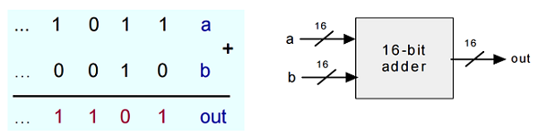
El Add16 realiza la suma de dos números binarios de 16 bits. Está compuesto por una serie de FullAdders y HalfAdders interconectados, utiliza estos componentes para realizar la suma bit a bit de los números de entrada.

### Inc16
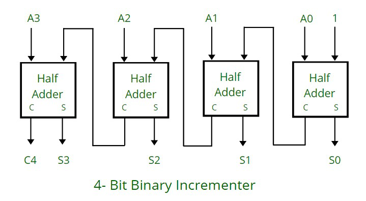
El Inc16 incrementa en uno un número binario de 16 bits. Esencialmente, el Inc16 es una versión modificada del Add16, se utiliza este para realizar la suma de entrada y luego agrega un bit adicional para manejar el acarreo.

### ALU
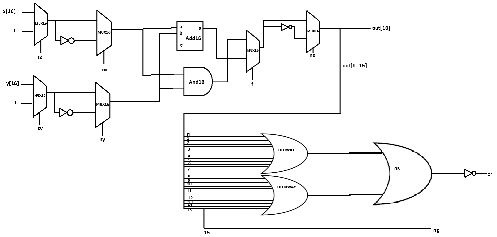
ALU funciona de manera condicional sobre ambas entradas X y Y ambas de 16 bits si se niegan o simplemente cero,
hay un selector que decide sobre la suma o el AND de ambos resultados y finalmente para mirar si el resultado es
cero se hacen operaciones or anidadas de todas las posiciones del resultado y  se coge el ultimo bit para mirar el
signo de esta operación.

# PRACTICA 01
## PROYECTO-01: Lógica Booleana
En el proyecto que presentamos a continuación, se llevará a cabo la implementación de una serie de compuertas lógicas utilizando la plataforma Nand2Tetris. Estas compuertas lógicas son componentes fundamentales de la electrónica digital y la informática, desempeñando un papel crucial en la construcción de circuitos y sistemas digitales. A través de este trabajo, exploraremos la creación y funcionalidad de estas compuertas, demostrando cómo pueden combinarse para realizar operaciones lógicas más complejas.

### Funcion NOT
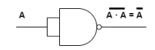

Su función principal es invertir una señal de entrada binaria, cambia un 1 en un 0 y viceversa.

### Funcion OR
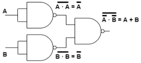

Esta función tiene al menos dos entradas y una sola salida, se conoce como la compuerta suma. La tabla de verdad de una compuerta OR muestra cómo se comporta en función de las entradas:

<ul>
  <li>Si al menos una de las entradas es 1, la salida es 1</li>
  <li>Solo si todas las entradas son 0, la salida es 0</li>
</ul>

### Funcion AND
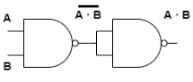

Esta función presenta dos entradas y una sola salida, su funcionamiento es similar a una multiplicación de entradas. La tabla de verdad de una compuerta AND muestra cómo se comporta en función de las entradas:

<ul>
  <li>La salida es 1 solo si todas las entradas son 1</li>
  <li>Si alguna de las entradas es 0, la salida es 0</li>
</ul>

### Funcion XOR

Esta función presenta dos entradas y una sola salida, también llamado OR exclusivo. La tabla de verdad de una compuerta XOR muestra cómo se comporta en función de las entradas:

<ul>
  <li>La salida es 1 cuando un número impar de entradas son 1</li>
  <li>Si el número de entradas 1 es par, la salida es 0</li>
</ul>

### Funcion MUX
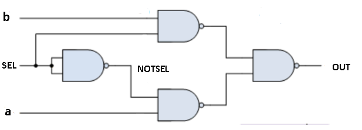

Esta función multiplexor toma de salida a si el selector es 0 o  toma la entrada b si el selector es 1,
  entonces se utilizan una nand de dos nands que una tiene a y el selector negado y la otra una nand que
  tiene b y el selector

### Funcion MUX16

Esta Función toma un array de 16 entradas de a y b donde al evaluar
  la función MUX retorna un array de 16 salidas, dependiendo si el selector es 0 el array de la
  salida es igual al array de entradas a si entonces el selector es 1 el array de salidas es igual
  al array de entradas b

### Funcion MUX4WAY16
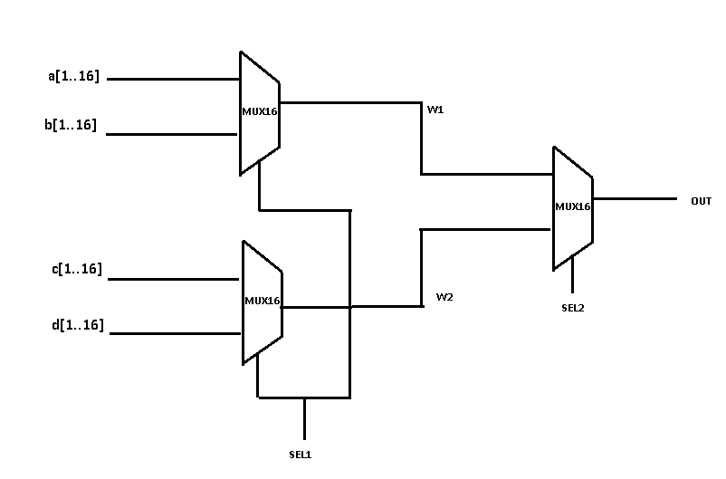

Esta Función toma 4 arrays de 16 entradas cada uno, recibe dos selectores, concantenado la salida de dos compuertas MUX16 unidas al selector 1 a una MUX16 unida al selector 2 de tal manera que:

<ul>
  <li>Si en el primer selector recibe 0 y el segundo 0 el array de 16 salidas sera igual al array de 16 de entradas de a</li>
  <li>Si en el primer selector recibe 0 y el segundo 1 el array de 16 salidas sera igual al array de 16 de entradas de b</li>
  <li>Si en el primer selector recibe 1 y el segundo 0 el array de 16 salidas sera igual al array de 16 de entradas de c</li>
  <li>Si en el primer selector recibe 1 y el segundo 1 el array de 16 salidas sera igual al array de 16 de entradas de d</li>
</ul>

### Funcion MUX8WAY16
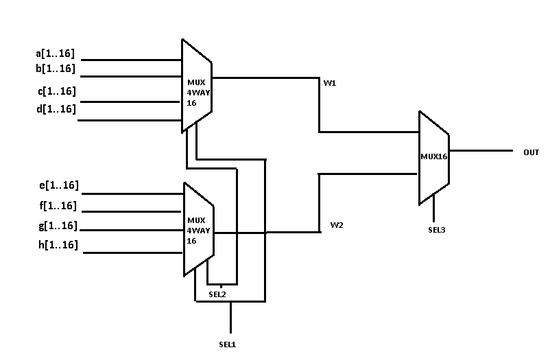

Esta Función toma 8 arrays de 16 entradas cada uno, recibe tres selectores, concantenado la salida de dos compuertas MUX4WAY16 unidas al selector 1y2 a una MUX16 unida al selector 3 de tal manera que:

<ul>
  <li>Si en el primer selector recibe 0 , el segundo 0 y el tercero 0 el array de 16 salidas sera igual al array de 16 de entradas de a</li>
  <li>Si en el primer selector recibe 0 , el segundo 0 y el tercero 1 el array de 16 salidas sera igual al array de 16 de entradas de b</li>
  <li>Si en el primer selector recibe 0 , el segundo 1 y el tercero 0 el array de 16 salidas sera igual al array de 16 de entradas de c</li>
  <li>Si en el primer selector recibe 0 , el segundo 1 y el tercero 1 el array de 16 salidas sera igual al array de 16 de entradas de d</li>
  <li>Si en el primer selector recibe 1 , el segundo 0 y el tercero 0 el array de 16 salidas sera igual al array de 16 de entradas de e</li>
  <li>Si en el primer selector recibe 1 , el segundo 0 y el tercero 1 el array de 16 salidas sera igual al array de 16 de entradas de f</li>
  <li>Si en el primer selector recibe 1, el segundo 1 y el tercero 0 el array de 16 salidas sera igual al array de 16 de entradas de g</li>
  <li>Si en el primer selector recibe 1 , el segundo 1 y el tercero 1 el array de 16 salidas sera igual al array de 16 de entradas de h</li>
</ul>

### Funcion DMUX
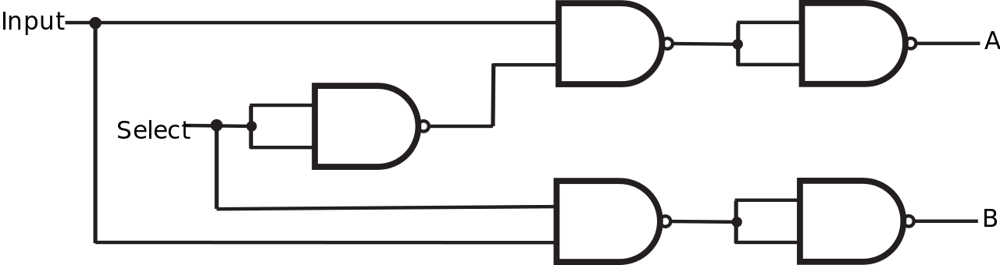

Para la creación del Demultiplexor(DMUX) se emplean 5 NANDs o 2 NANDs y una NOT, tiene 1 entrada y s1 que es una señal de control y dos salidas

<h1>Funcion DMUX4WAY</h1>
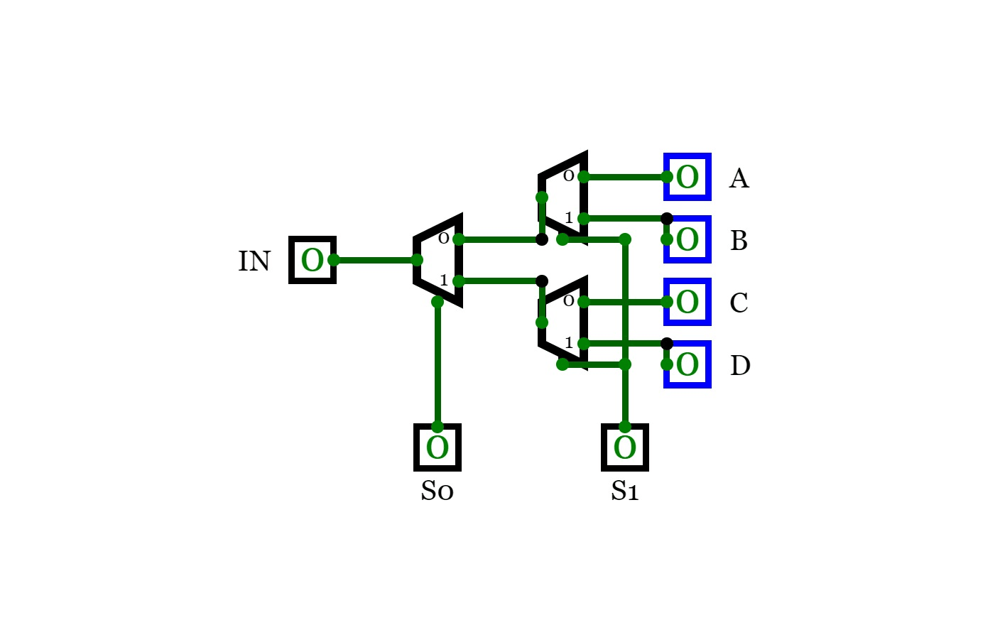

Para el demultiplexor de 4 vías se usan 3 demultiplexores, tiene 1 entrada, dos señales de control y 4 salidas
</ul>
<h1>Funcion DMUX8WAY</h1>
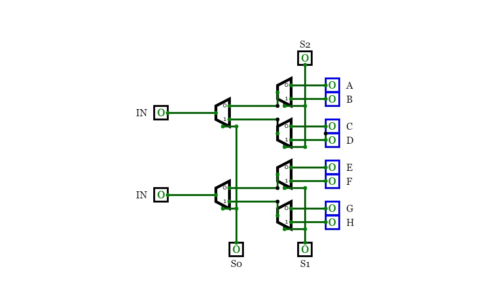
Para el demultiplexor de 4 vías se usan 3 demultiplexores, tiene 1 entrada, 3 señales de control y 8 salidas

### NOT16
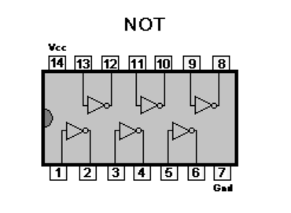

La función de una compuerta Not16 es invertir lógicamente cada uno de los 16 bits de entrada. En otras palabras, toma una entrada de 16 bits y produce una salida de 16 bits donde cada bit de salida es el complemento del bit de entrada correspondiente.

  
### OR16
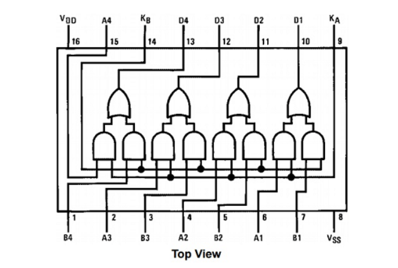

La función de una compuerta Or16 es realizar una operación lógica OR en paralelo en cada uno de los 16 bits de entrada. En otras palabras, toma dos entradas de 16 bits (a y b) y produce una salida de 16 bits (out), donde cada bit de salida es el resultado de la operación lógica OR aplicada a los bits correspondientes de a y b.

### OR8WAY
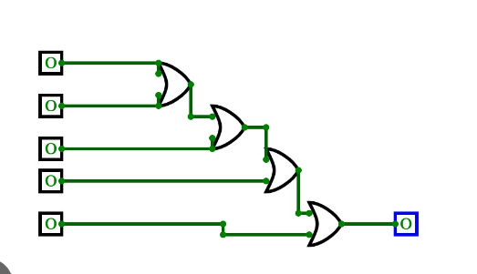

La función de una compuerta Or8Way es realizar una operación lógica OR en ocho bits de entrada de manera que la salida sea 1 si al menos uno de los bits de entrada es 1, y 0 si todos los bits de entrada son 0. En otras palabras, Or8Way toma ocho entradas y produce una sola salida, donde la salida será 1 si al menos una de las entradas es 1, y 0 solo si todas las entradas son 0.

  
### AND16

La función de una compuerta And16 es realizar una operación lógica AND en paralelo en cada uno de los 16 bits de entrada. En otras palabras, toma dos entradas de 16 bits (a y b) y produce una salida de 16 bits (out), donde cada bit de salida es el resultado de la operación lógica AND aplicada a los bits correspondientes de a y b.

