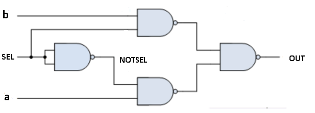
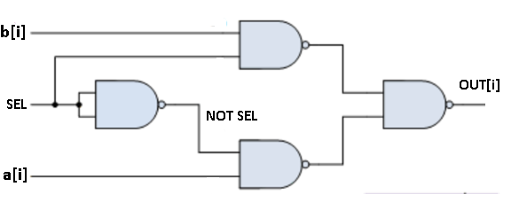
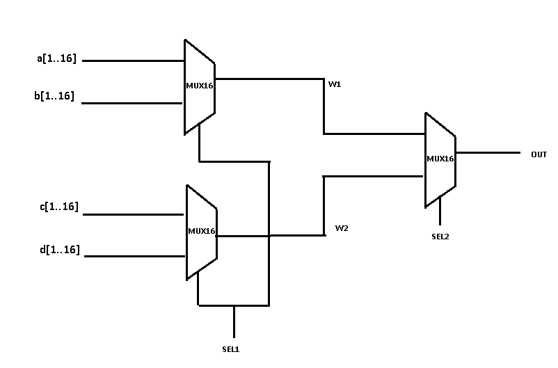

# PROYECTO-01
En el proyecto se podrá encontrar la implementación en Nand2Tetris de las siguientes compuertas lógicas.

<h1>Funcion NOT</h1>

Su función principal es invertir una señal de entrada binaria, cambia un 1 en un 0 y viceversa.

<h1>Funcion MUX</h1>

Esta función multiplexor toma de salida a si el selector es 0 o  toma la entrada b si el selector es 1,
  entonces se utilizan una nand de dos nands que una tiene a y el selector negado y la otra una nand que
  tiene b y el selector

<h1>Funcion MUX16</h1>

Esta Función toma un array de 16 entradas de a y b donde al evaluar
  la función MUX retorna un array de 16 salidas, dependiendo si el selector es 0 el array de la
  salida es igual al array de entradas a si entonces el selector es 1 el array de salidas es igual
  al array de entradas b

<h1>Funcion MUX4WAY16</h1>

Esta Función toma 4 arrays de 16 entradas cada uno, recibe dos selectores, concantenado la salida de dos compuertas MUX16 unidas al selector 1 a una MUX15 unida al selector 2 de tal manera que:

<ul>
  <li>Si en el primer selector recibe 0 y el segundo 0 el array de 16 salidas sera igual al array de 16 de entradas de a</li>
  <li>Si en el primer selector recibe 0 y el segundo 1 el array de 16 salidas sera igual al array de 16 de entradas de b</li>
  <li>Si en el primer selector recibe 1 y el segundo 0 el array de 16 salidas sera igual al array de 16 de entradas de c</li>
  <li>Si en el primer selector recibe 1 y el segundo 1 el array de 16 salidas sera igual al array de 16 de entradas de d</li>
  

</ul>
