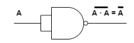
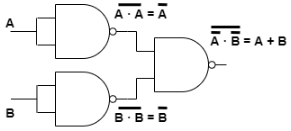
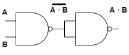
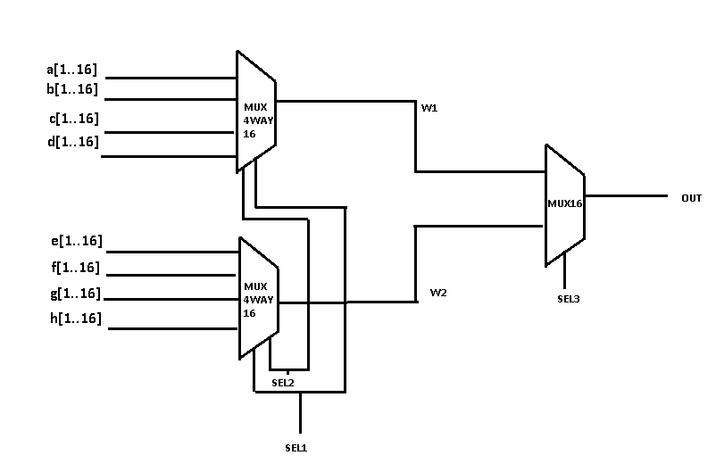

# PROYECTO-01
En el proyecto que presentamos a continuación, se llevará a cabo la implementación de una serie de compuertas lógicas utilizando la plataforma Nand2Tetris. Estas compuertas lógicas son componentes fundamentales de la electrónica digital y la informática, desempeñando un papel crucial en la construcción de circuitos y sistemas digitales. A través de este trabajo, exploraremos la creación y funcionalidad de estas compuertas, demostrando cómo pueden combinarse para realizar operaciones lógicas más complejas.

<h1>Funcion NOT</h1>

Su función principal es invertir una señal de entrada binaria, cambia un 1 en un 0 y viceversa.

<h1>Funcion OR</h1>

Esta función tiene al menos dos entradas y una sola salida, se conoce como la compuerta suma. La tabla de verdad de una compuerta OR muestra cómo se comporta en función de las entradas:

<ul>
  <li>Si al menos una de las entradas es 1, la salida es 1</li>
  <li>Solo si todas las entradas son 0, la salida es 0</li>
</ul>

<h1>Funcion AND</h1>

Esta función presenta dos entradas y una sola salida, su funcionamiento es similar a una multiplicación de entradas. La tabla de verdad de una compuerta AND muestra cómo se comporta en función de las entradas:

<ul>
  <li>La salida es 1 solo si todas las entradas son 1</li>
  <li>Si alguna de las entradas es 0, la salida es 0</li>
</ul>

<h1>Funcion XOR</h1>

Esta función presenta dos entradas y una sola salida, también llamado OR exclusivo. La tabla de verdad de una compuerta XOR muestra cómo se comporta en función de las entradas:

<ul>
  <li>La salida es 1 cuando un número impar de entradas son 1</li>
  <li>Si el número de entradas 1 es par, la salida es 0</li>
</ul>

<h1>Funcion MUX</h1>

Esta función multiplexor toma de salida a si el selector es 0 o  toma la entrada b si el selector es 1,
  entonces se utilizan una nand de dos nands que una tiene a y el selector negado y la otra una nand que
  tiene b y el selector

<h1>Funcion MUX16</h1>

Esta Función toma un array de 16 entradas de a y b donde al evaluar
  la función MUX retorna un array de 16 salidas, dependiendo si el selector es 0 el array de la
  salida es igual al array de entradas a si entonces el selector es 1 el array de salidas es igual
  al array de entradas b

<h1>Funcion MUX4WAY16</h1>

Esta Función toma 4 arrays de 16 entradas cada uno, recibe dos selectores, concantenado la salida de dos compuertas MUX16 unidas al selector 1 a una MUX16 unida al selector 2 de tal manera que:

<ul>
  <li>Si en el primer selector recibe 0 y el segundo 0 el array de 16 salidas sera igual al array de 16 de entradas de a</li>
  <li>Si en el primer selector recibe 0 y el segundo 1 el array de 16 salidas sera igual al array de 16 de entradas de b</li>
  <li>Si en el primer selector recibe 1 y el segundo 0 el array de 16 salidas sera igual al array de 16 de entradas de c</li>
  <li>Si en el primer selector recibe 1 y el segundo 1 el array de 16 salidas sera igual al array de 16 de entradas de d</li>
</ul>
<h1>Funcion MUX8WAY16</h1>

Esta Función toma 8 arrays de 16 entradas cada uno, recibe tres selectores, concantenado la salida de dos compuertas MUX4WAY16 unidas al selector 1y2 a una MUX16 unida al selector 3 de tal manera que:

<ul>
  <li>Si en el primer selector recibe 0 , el segundo 0 y el tercero 0 el array de 16 salidas sera igual al array de 16 de entradas de a</li>
  <li>Si en el primer selector recibe 0 , el segundo 0 y el tercero 1 el array de 16 salidas sera igual al array de 16 de entradas de b</li>
  <li>Si en el primer selector recibe 0 , el segundo 1 y el tercero 0 el array de 16 salidas sera igual al array de 16 de entradas de c</li>
  <li>Si en el primer selector recibe 0 , el segundo 1 y el tercero 1 el array de 16 salidas sera igual al array de 16 de entradas de d</li>
  <li>Si en el primer selector recibe 1 , el segundo 0 y el tercero 0 el array de 16 salidas sera igual al array de 16 de entradas de e</li>
  <li>Si en el primer selector recibe 1 , el segundo 0 y el tercero 1 el array de 16 salidas sera igual al array de 16 de entradas de f</li>
  <li>Si en el primer selector recibe 1, el segundo 1 y el tercero 0 el array de 16 salidas sera igual al array de 16 de entradas de g</li>
  <li>Si en el primer selector recibe 1 , el segundo 1 y el tercero 1 el array de 16 salidas sera igual al array de 16 de entradas de h</li>
</ul>
